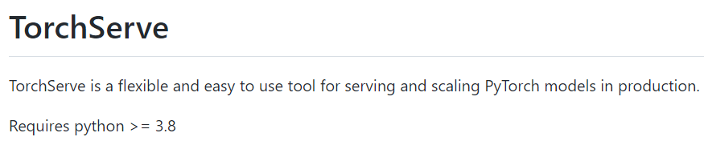

## 简介

经过前 [两篇博客](https://yqstar.github.io/tags/Pytorch-Tutorial/) 学习，我们已可使用CNN模型完成Mnist手写数字分类模型，对于算法从数据处理、模型构建、模型训练和评估链路有初步认知。但工业可能需要部署离线在线模型用于提供模型推理服务，所谓模型推理服务是指在系统配置训练完成机器学习模型，以便其可接受新的输入并将推理结果返回给系统。

其次，虽然很多大厂都会有封装好部署平台供算法人员便捷配置，但是学习中对于完整的工程链路开发对于个人能力建设也是非常重要的，而不是仅仅作为一颗螺丝钉，如何实现从Demo模型转换成线上模型推理服务部署，对于个人的正向反馈也是非常有意义的。

那么针对 *PyTorch* 训练好 Demo 模型，如何部署到生产环境用于提供模型推理服务呢？部署形式非常多样，其中 TorchServe 是 [PyTorch开源项目](https://pytorch.org/serve/index.html) 部分，是AWS和Facebook合作开发的用于部署Pytorch的模型，对于算法工程师是相当友好的。本章介绍如何使用TorchServe完成PyTorch模型的部署和调用。

## TorchServe简介

Torchserve是PyTorch的首选模型部署解决方案。它允许为模型公开一个可供直接访问或者应用程序访问的WebAPI，借助TorchServe，PyTorch用户可以更快地将其模型应用于生产，而无需编写自定义代码，此外，TorchServe将工程开发和算法开发进行解耦，算法工程师主要完成数据Process和模型构建这一擅长领域，其他的多模型服务、A/B测试的版本控制、监视指标以及应用程序集成RESTful都已封装好。

> TorchServe is a performant, flexible and easy to use tool for serving PyTorch eager mode and torschripted models.

官网介绍可看出：TorchServe是一款性能好、灵活性好、易使用的工具，其次可部署模型类型是Pytorch的Eager模式和Script模式模型。

TorchServe框架主要分为四个部分：Frontend是TorchServe的请求和响应的处理部分；WorkerProcess 指的是一组运行的模型实例，可以由管理API设定运行的数量；Model Store是模型存储加载的地方；Backend用于管理Worker Process，具体可参考下图里。


## 环境安装

本人使用 Windows11+WSL2+Ubuntu 环境进行部署。

### Conda配置

[官网要求](https://github.com/pytorch/serve)：Python Version >= 3.8，本文使用Conda管理深度学习环境，具体使用可参考之前的博文：[深度学习管理配置](https://yqstar.github.io/2022/05/01/Windows%E7%B3%BB%E7%BB%9F%E4%BD%BF%E7%94%A8Conda%E9%85%8D%E7%BD%AE%E6%B7%B1%E5%BA%A6%E5%AD%A6%E4%B9%A0%E7%8E%AF%E5%A2%83/)。



可使用下述命令创建Conda的Python环境（python版本为3.8，环境名为ts_ENV）和激活指定环境(ts_env)。

``` bash
conda create --name ts_env python=3.8
conda activate ts_env
```

### TS源码安装

可参考官网TS安装[文档](https://pytorch.org/serve/torchserve_on_wsl.html)。

``` bash
git clone https://github.com/pytorch/serve.git
cd serve

./ts_scripts/setup_wsl_ubuntu
export PATH=$HOME/.local/bin:$PATH
python ./ts_scripts/install_from_src.py
echo 'export PATH=$HOME/.local/bin:$PATH' >> ~/.bashrc
source ~/.bashrc
```

## 模型打包

TorchServe 的一个关键特性是能够将所有模型工件打包到单个模型存档文件中。它是一个单独的命令行界面 (CLI)，torch-model-archiver，可以使用 state_dict 获取模型检查点或模型定义文件，并将它们打包成 .mar 文件。 然后，任何使用 TorchServe 的人都可以重新分发和提供该文件。它包含以下模型工件：在 torchscript 或模型定义文件的情况下的模型检查点文件和在急切模式的情况下的 state_dict 文件，以及服务模型可能需要的其他可选资产。 CLI 创建一个 .mar 文件，TorchServe 的服务器 CLI 使用该文件为模型提供服务。

torch-model-archiver 命令来打包模型，需要提供以下三个文件。

第 1 步：创建一个新的模型架构文件，其中包含从 torch.nn.modules 扩展的模型类。在这个例子中，我们创建了mnist模型文件mnist_model.py文件。

``` python
import torch
from torch import nn
import torch.nn.functional as F

# 构建网络
class MnistClassificationNet(nn.Module):
    def __init__(self):
        super().__init__()
        self.conv1 = nn.Conv2d(in_channels=1, out_channels=32, kernel_size=3)
        self.conv2 = nn.Conv2d(in_channels=32, out_channels=64, kernel_size=3)
        self.max_pool2d = nn.MaxPool2d(kernel_size=2)
        self.dropout = nn.Dropout2d(p=0.25)
        # self.relu = nn.ReLU()
        self.fc1 = nn.Linear(in_features=9216, out_features=128)
        self.fc2 = nn.Linear(in_features=128, out_features=10)
        self.log_softmax = nn.LogSoftmax(dim=1)

    def forward(self, x):
        x = self.conv1(x)
        x = F.relu(x)
        x = self.conv2(x)
        x = F.relu(x)
        x= self.max_pool2d(x)
        x = self.dropout(x)
        x = x.view(-1, 9216)
        x = self.fc1(x)
        x = F.relu(x)
        x = self.fc2(x)
        x= self.log_softmax(x)
        return x
```

第 2 步：使用 [mnist_sd](https://yqstar.github.io/2022/05/11/Pytorch系列自学教程-2-深度学习“Hello-World”之Mnist图像分类/) 训练 MNIST 数字识别模型并保存模型的状态字典。

``` python
torch.save(model.state_dict(), "./checkpoints/model_pth/mnist_sd.pt")
```

第 3 步：编写自定义处理程序以在您的模型上运行推理。 在此示例中，我们添加了一个 mnist_handler.py 文件，它使用上述模型对输入灰度图像进行推理并识别图像中的数字。

``` python
from torchvision import transforms
from ts.torch_handler.image_classifier import ImageClassifier
from torch.profiler import ProfilerActivity


class MNISTDigitClassifier(ImageClassifier):
    """
    MNISTDigitClassifier handler class. This handler extends class ImageClassifier from image_classifier.py, a
    default handler. This handler takes an image and returns the number in that image.
    Here method postprocess() has been overridden while others are reused from parent class.
    """

    image_processing = transforms.Compose([
        transforms.ToTensor()
        # transforms.Normalize((0.1307,), (0.3081,))
    ])

    def __init__(self):
        super(MNISTDigitClassifier, self).__init__()
        self.profiler_args = {
            "activities" : [ProfilerActivity.CPU],
            "record_shapes": True,
        }


    def postprocess(self, data):
        """The post process of MNIST converts the predicted output response to a label.
        Args:
            data (list): The predicted output from the Inference with probabilities is passed
            to the post-process function
        Returns:
            list : A list of dictionaries with predictions and explanations is returned
        """
        return data.argmax(1).tolist()
        # return data.tolist()
```

第 4 步：使用 torch-model-archiver 程序创建一个 Torch 模型存档以存档上述文件。

``` bash
$ torch-model-archiver -h
usage: torch-model-archiver [-h] --model-name MODEL_NAME  --version MODEL_VERSION_NUMBER
                      --model-file MODEL_FILE_PATH --serialized-file MODEL_SERIALIZED_PATH
                      --handler HANDLER [--runtime {python,python2,python3}]
                      [--export-path EXPORT_PATH] [-f] [--requirements-file]

Model Archiver Tool

optional arguments:
  -h, --help            show this help message and exit
  --model-name MODEL_NAME
                        Exported model name. Exported file will be named as
                        model-name.mar and saved in current working directory
                        if no --export-path is specified, else it will be
                        saved under the export path
  --serialized-file SERIALIZED_FILE
                        Path to .pt or .pth file containing state_dict in
                        case of eager mode or an executable ScriptModule
                        in case of TorchScript.
  --model-file MODEL_FILE
                        Path to python file containing model architecture.
                        This parameter is mandatory for eager mode models.
                        The model architecture file must contain only one
                        class definition extended from torch.nn.modules.
  --handler HANDLER     TorchServe's default handler name  or handler python
                        file path to handle custom TorchServe inference logic.
  --extra-files EXTRA_FILES
                        Comma separated path to extra dependency files.
  --runtime {python,python2,python3}
                        The runtime specifies which language to run your
                        inference code on. The default runtime is
                        RuntimeType.PYTHON. At the present moment we support
                        the following runtimes python, python2, python3
  --export-path EXPORT_PATH
                        Path where the exported .mar file will be saved. This
                        is an optional parameter. If --export-path is not
                        specified, the file will be saved in the current
                        working directory.
  --archive-format {tgz,default}
                        The format in which the model artifacts are archived.
                        "tgz": This creates the model-archive in <model-name>.tar.gz format.
                        If platform hosting requires model-artifacts to be in ".tar.gz"
                        use this option.
                        "no-archive": This option creates an non-archived version of model artifacts
                        at "export-path/{model-name}" location. As a result of this choice,
                        MANIFEST file will be created at "export-path/{model-name}" location
                        without archiving these model files
                        "default": This creates the model-archive in <model-name>.mar format.
                        This is the default archiving format. Models archived in this format
                        will be readily hostable on TorchServe.
  -f, --force           When the -f or --force flag is specified, an existing
                        .mar file with same name as that provided in --model-
                        name in the path specified by --export-path will
                        overwritten
  -v, --version         Model's version.
  -r, --requirements-file
                        Path to requirements.txt file containing a list of model specific python
                        packages to be installed by TorchServe for seamless model serving.
```

``` bash
torch-model-archiver --model-name mnist --version 1.0 --model-file mnist_model.py --serialized-file mnist_sd.pt --export-path ./model_store --handler mnist_handler.py -f
```

## 模型部署

``` bash
$ torchserve --help
usage: torchserve [-h] [-v | --version]
                          [--start]
                          [--stop]
                          [--ts-config TS_CONFIG]
                          [--model-store MODEL_STORE]
                          [--workflow-store WORKFLOW_STORE]
                          [--models MODEL_PATH1 MODEL_NAME=MODEL_PATH2... [MODEL_PATH1 MODEL_NAME=MODEL_PATH2... ...]]
                          [--log-config LOG_CONFIG]

torchserve

mandatory arguments:
  --model-store MODEL_STORE
                        Model store location where models can be loaded

  

optional arguments:
  -h, --help            show this help message and exit
  -v, --version         Return TorchServe Version
  --start               Start the model-server
  --stop                Stop the model-server
  --ts-config TS_CONFIG
                        Configuration file for TorchServe

  --models MODEL_PATH1 MODEL_NAME=MODEL_PATH2... [MODEL_PATH1 MODEL_NAME=MODEL_PATH2... ...]
                        Models to be loaded using [model_name=]model_location
                        format. Location can be a HTTP URL, a model archive
                        file or directory contains model archive files in
                        MODEL_STORE.
  --log-config LOG_CONFIG
                        Log4j configuration file for TorchServe
  --ncs, --no-config-snapshots         
                        Disable snapshot feature
  --workflow-store WORKFLOW_STORE
                        Workflow store location where workflow can be loaded. Defaults to model-store
```

### 启动torchserve服务

``` bash
torchserve --start --ncs --model-store model_store --models mnist.mar
```

模型启动日志如下截图：


### 推理健康检查API

``` bash
curl http://localhost:8080/ping
```

如果server正常运行, 响应会如截图所示：


### 推理

``` bash
curl http://127.0.0.1:8080/predictions/mnist -T ./data/test.png
```

test.png为数字为0的图片，通过上述的调用推理，可以看出结果是能正常返回的，是可以作为下游应用调用。


### 停止torchserve服务

``` bash
torchserve --start
```

## 探索

[完整代码](https://github.com/yqstar/Awesome_Pytorch_Tutorial/tree/master/Pytorch_Lesson3)已上传Github，有需要的可以自行下载代码，如果对你有帮助，请Star，哈哈哈哈！

到此为止，已经可以使用自己数据玩耍各种Demo，快（苦）乐（逼）地进行炼丹之路。道路阻且长，行则将至，但行好事莫问前程。

* 除了使用TorchServe部署模型，还有其他的解决方案吗？
* 除了使用提供这种Web API的形式，是否可以构建一个GUI的形式提供呢？例如 PYQT5 ？这里放一张PYQT5的图，后面会填坑。


正如，人往往会对未知的事情产生恐惧，因为结局是未知的。所以当一切不再未知的时候，那么是不是就不会产生恐惧呢？

## 参考

More info: [Chenglu：如何部署PyTorch模型](https://zhuanlan.zhihu.com/p/344364948)
More info: [TorchServe](https://github.com/pytorch/serve)
More info: [TorchServe_Mnist Example](https://github.com/pytorch/serve/tree/master/examples/image_classifier/mnist)
More info: [随便写点笔记](https://blog.csdn.net/weixin_41977938/article/details/122258595)
More info: [PyTorch Eager mode and Script mode](https://blog.csdn.net/Chris_zhangrx/article/details/117380516)
More info: [Self-host your 🤗HuggingFace Transformer NER model with Torchserve + Streamlit](https://cceyda.github.io/blog/huggingface/torchserve/streamlit/ner/2020/10/09/huggingface_streamlit_serve.html)
More info: [TorchServe搭建codeBERT分类模型服务](https://ceshiren.com/t/topic/20770)
More info: [torchserver模型本地部署和docker部署](https://blog.csdn.net/qq_15821487/article/details/122684773)
