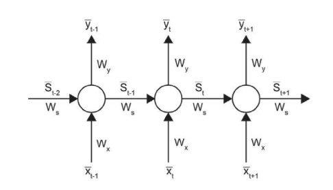

## 序列模型介绍

循环神经网络（Recurrent Neural Network，RNN）是一种用于处理序列数据的神经网络。相比一般的神经网络来说，他能够处理序列变化的数据。比如某个单词的意思会因为上文提到的内容不同而有不同的含义，RNN就能够很好地解决这类问题。
RNN也可以堆叠在一起。需要注意的是，堆中的每个RNN都有自己的权重矩阵。因此，权重矩阵在水平轴（时间轴）上共享，而不是在垂直轴（RNN的数量）上共享。

因RNN模型训练采用BPTT算法(BackPropagation Through Time)，导致RNN有一个主要的缺点，即所谓的梯度消失和梯度爆炸，而梯度爆炸问题可以通过梯度裁剪，去抑制，梯度消失的问题是随着反向传播，梯度越来越小，在这些网络中，随着时间步长的增加，反向传播使梯度变得越来越小，导致梯度消失。进而导致RNN长期依赖问题。
注意，裁剪仅限制梯度的大小，而不限制其方向。所以，学习仍然朝着正确的方向前进。

https://www.zhihu.com/question/279046805/answer/1153623199