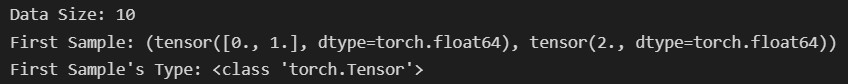
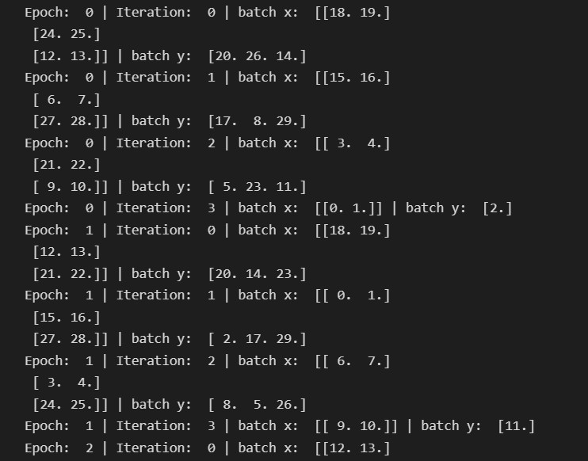

深度学习模型，区别于其他的机器学习模型，一方面，模型训练所需的数据量通常是非常大的，是无法一次性加载到内存中；另一方面，模型训练多采用基于梯度下降的优化方法对模型的权重和偏置进行逐步调整的，不可能一次性地在模型中进行正向传播和反向传播。通常，我们需要进行数据加载和预处理处理，将其封装成适合迭代训练的形式，具体会对整个数据进行随机打乱，然后将原始数据处理成一个一个的Batch，然后送到模型中进行训练。

深度学习模型流程中一般都是先解决数据加载问题，包括数据的**输入问题**和**预处理问题**，数据加载处理在深度学习链路中起着非常重要的基础作用。这篇文章将介绍Pytorch对自定义数据集进行封装的方法。

## Dataset、Batch、Iteration和Epoch的关系

在介绍如何使用Pytorch加载数据前，简单介绍下，**Dataset**，**Batch**，**Iteration** 和 **Epoch** 的区别和关系。

   名词    |                                            解释
 :-------: | :-----------------------------------------------------------------------------------------:
  Dataset  |                                     待训练的全量数据集
   Batch   | 待训练全量数据集的一小部分样本对模型进行一次反向传播参数更新，这一小部分样本称为“一个Batch”
 Iteration |            使用一个Batch数据对模型进行一次参数更新的过程，称之为“一次Iteration”
   Epoch   |               待训练全量数据集对模型进行一次完整的参数更新，称之为“一个Epoch”

假设DatasetSize=10，BatchSize=3，那么每个Epoch会执行4个Iteration，对应四个Batch，每个BatchSize大小分别包括3，3，3和1个样本。


## Pytoch数据处理：DataSet和DataLoader

Pytorch提供了几个有用的工具：**torch.utils.data.Dataset类**和**torch.utils.data.DataLoader类**，用于数据读取和预处理。
基本流程是先把原始数据转变成torch.utils.data.Dataset类，随后把得到的torch.utils.data.Dataset类当作一个参数传递给torch.utils.data.DataLoader类，得到一个数据加载器，这个数据加载器每次可以返回一个Batch的数据供模型训练使用。

### torch.utils.data.Dataset类

*torch.utils.data.Dataset*是代表这一数据的抽象类，你可以自己定义数据类，继承和重写这个抽象类，只需要定义__init__，__len__和__getitem__这三个魔法函数,其中：

* \__init__()：用于初始化原始数据的路径和文件名等。
* \__len__()：用于返回数据集中的样本总个数。
* \__getitem__()：用于返回指定索引的样本所对应的输入变量与输出变量。

``` python
# class CustomDataset(torch.utils.data.Dataset):#需要继承data.Dataset
#     def __init__(self):
#         # TODO
#         # 1. Initialize file path or list of file names.
#         pass
#     def __getitem__(self, index):
#         # TODO
#         # 1. Read one data from file (e.g. using numpy.fromfile, PIL.Image.open).
#         # 2. Preprocess the data (e.g. torchvision.Transform).
#         # 3. Return a data pair (e.g. image and label).
#         #这里需要注意的是，第一步：read one data，是一个data
#         pass
#     def __len__(self):
#         # You should change 0 to the total size of your dataset.
#         pass
```

用原始数据构造出来的*Dataset子类*可以理解成一个静态数据池，这个数据池使得我们可以用*索引*得到某个样本数据，而想要该数据池流动起来，源源不断地输出*Batch*供给给模型训练，还需要下一个工具*DataLoader类*。所以我们把创建的*Dataset子类*当参数传入即将构建的*DataLoader类*才是使用*Dataset子类*最终目的。

### torch.utils.data.DataLoader类

DataLoader(object)可用参数:

* dataset(Dataset): 传入的数据集。
* batch_size(int, optional): 每个batch有多少样本。
* shuffle(bool, optional): 在每个epoch开始时，对数据进行打乱排序。
* sampler(Sampler, optional): 自定义从数据集中取样本的策略，如果指定这个参数，那么shuffle必须为False。
* batch_sampler(Sampler, optional): 与sampler类似，但是一次只返回一个batch的indices（索引），需要注意的是，一旦指定了这个参数，那么batch_size,shuffle,sampler,drop_last就不能再配置（互斥）。
* num_workers (int, optional): 决定了有几个进程来处理data loading。0意味着所有的数据都会被load进主进程。（默认为0）
* collate_fn (callable, optional): 将一个list的sample组成一个mini-batch的函数。
* pin_memory (bool, optional)： 如果设置为True，那么data loader将会在返回它们之前，将tensors拷贝到CUDA中的固定内存中。
* drop_last (bool, optional):如果设置为True：这个是对最后的未完成的batch来说的，比如batch_size设置为64，而一个epoch只有100个样本，那么训练时后面36个样本会被丢弃。 如果为False（默认），那么会继续正常执行，只是最后的batch_size会小一点。
* timeout(numeric, optional):如果是正数，表明等待从worker进程中收集一个batch等待时间，若超出设定时间还没有收集到，那就不收集这个内容。这个numeric应总是大于等于0。默认为0
* worker_init_fn (callable, optional): 每个worker初始化函数。

## 实例

### txt数据读取

使用个人创建的txt文件数据，进行数据读取操作。

``` python
import torch
import numpy as np
from torch.utils.data import Dataset, DataLoader

class SampleTxtDataset(Dataset):
    def __init__(self):
        # 数据文件地址
        self.txt_file_path = "./sample_easy_data.txt"

    def __getitem__(self, item):
        txt_data = np.loadtxt(self.txt_file_path, delimiter=",")
        self._x = torch.from_numpy(txt_data[:, :2])
        self._y = torch.from_numpy(txt_data[:, 2])
        return self._x[item], self._y[item]

    def __len__(self):
        txt_data = np.loadtxt(self.txt_file_path, delimiter=",")
        self._len = len(txt_data)
        return self._len

sample_txt_dataset = SampleTxtDataset()

print("Data Size:",len(sample_txt_dataset))

print("First Sample:",next(iter(sample_txt_dataset)))

print("First Sample's Type:",type(next(iter(sample_txt_dataset))[0]))

sample_dataloader = DataLoader(dataset=sample_txt_dataset, batch_size=3, shuffle=True)

num_epochs = 4

for epoch in range(num_epochs):
    for iteration, (batch_x, batch_y) in enumerate(sample_dataloader):
        print('Epoch: ', epoch, '| Iteration: ', iteration, '| batch x: ', batch_x.numpy(), '| batch y: ', batch_y.numpy())

```

Dataset的示例结果：



DataLoader的示例结果：



### csv文件读取

使用常见离线数据csv文件进行数据加载和预处理。

``` python
import torch
import pandas as pd
from torch.utils.data import Dataset, DataLoader

class SampleCsvDataset(Dataset):
    def __init__(self):
        self.csv_file_path = "./sample_boston.csv"


    def __getitem__(self, item):
        raw_data = pd.read_csv(self.csv_file_path)
        raw_data_shape = raw_data.shape
        self._x  = torch.from_numpy(raw_data.iloc[:,:raw_data_shape[1]-1].values)
        self._y  = torch.from_numpy(raw_data.iloc[:,raw_data_shape[1]-1].values)
        return self._x[item], self._y[item]

    def __len__(self):
        raw_data = pd.read_csv(self.csv_file_path)
        raw_data_shape = raw_data.shape
        self._len = raw_data_shape[0]
        return self._len

sample_csv_dataset = SampleCsvDataset()

print("Data Size:",len(sample_csv_dataset))

print("First Sample:",next(iter(sample_csv_dataset)))

print("First Sample's Type:",type(next(iter(sample_csv_dataset))[0]))

sample_dataloader = DataLoader(dataset=sample_csv_dataset, batch_size=3, shuffle=True)

num_epochs = 4

for epoch in range(num_epochs):
    for iteration, (batch_x, batch_y) in enumerate(sample_dataloader):
        print('Epoch: ', epoch, '| Iteration: ', iteration, '| batch x: ', batch_x.numpy(), '| batch y: ', batch_y.numpy())

```

### mysql数据读取

生产落地数据多为数据库，本文也针对常见Mysql数据库进行了数据加载，使用的是MYSQL8.0数据库的示例数据库sakila.payment表进行数据读取演示。

``` python
import torch
import pandas as pd
import pymysql
from torch.utils.data import Dataset, DataLoader

class SampleMysqlDataset(Dataset):
    def __init__(self):
        # 初始化MySQL数据库连接配置参数
        self.mysql_host = "localhost"
        self.mysql_port = 3307
        self.mysql_user = "utest"
        self.mysql_password = "123456xyq"
        self.mysql_db = "sakila"
        self.mysql_table = "payment"
        self.mysql_charset = "utf8"
        self.mysql_sql_data = "select payment_id, customer_id, staff_id, rental_id, amount from sakila.payment"
        self.mysql_sql_cnt = "select count(*) from sakila.payment"

    def __getitem__(self, item):
        # 创建数据库连接
        conn = pymysql.connect(host=self.mysql_host,
                        port=self.mysql_port,
                        user=self.mysql_user,
                        password=self.mysql_password,
                        db=self.mysql_db,
                        charset=self.mysql_charset)
        raw_dataframe = pd.read_sql(self.mysql_sql_data, conn)
        raw_dataframe_shape = raw_dataframe.shape
        self._x  = torch.from_numpy(raw_dataframe.iloc[:,:raw_dataframe_shape[1]-1].values)
        self._y  = torch.from_numpy(raw_dataframe.iloc[:,raw_dataframe_shape[1]-1].values)
        return self._x[item], self._y[item]

    def __len__(self):
        # 创建数据库连接
        conn = pymysql.connect(host=self.mysql_host,
                        port=self.mysql_port,
                        user=self.mysql_user,
                        password=self.mysql_password,
                        db=self.mysql_db,
                        charset=self.mysql_charset)
        raw_dataframe = pd.read_sql(self.mysql_sql_data, conn)
        raw_dataframe_shape = raw_dataframe.shape
        self._len = raw_dataframe_shape[0]
        return self._len

sample_mysql_dataset = SampleMysqlDataset()

print("Data Size:",len(sample_mysql_dataset))

print("First Sample:",next(iter(sample_mysql_dataset)))

print("First Sample's Type:",type(next(iter(sample_mysql_dataset))[0]))

sample_dataloader = DataLoader(dataset=sample_mysql_dataset, batch_size=3, shuffle=True)

num_epochs = 4

for epoch in range(num_epochs):
    for iteration, (batch_x, batch_y) in enumerate(sample_dataloader):
        print('Epoch: ', epoch, '| Iteration: ', iteration, '| batch x: ', batch_x.numpy(), '| batch y: ', batch_y.numpy())

```

### 使用pytorch自带数据集

为方便快速试验，Pytorch也集成了常见的数据集在torchaudio，torchtext和torchvision中，本代码使用torchvision读取常用的图像算法数据集MNIST，具体代码如下。

``` python
from torchvision import datasets, transforms
from torch.utils.data import DataLoader

# 导入训练集
sample_mnist_dataset = datasets.MNIST(root=r'./data',
                              transform=transforms.ToTensor(),
                              train=True,
                              download=True)

print("Data Size:",len(sample_mnist_dataset))

print("First Sample:",next(iter(sample_mnist_dataset)))

print("First Sample's Type:",type(next(iter(sample_mnist_dataset))[0]))

sample_dataloader = DataLoader(dataset=sample_mnist_dataset, batch_size=3, shuffle=True)

num_epochs = 4

for epoch in range(num_epochs):
    for iter, (batch_x, batch_y) in enumerate(sample_dataloader):
        print('Epoch: ', epoch, '| Iteration: ', iter, '| batch x: ', batch_x.numpy(), '| batch y: ', batch_y.numpy())

```

## 探索

已上传Github，有需要的可以自行下载代码，如果对你有帮助，请Star，哈哈哈哈！

* 生产读取大量数据无法一次加载到内存该如何操作呢？

* 如何使用TorchData进行数据读取和预处理？

## 参考

More info: [pan_jinquan：Dataset, DataLoader产生自定义的训练数据](https://blog.csdn.net/guyuealian/article/details/88343924)

More info: [夜和大帝：Dataset类的使用](https://www.jianshu.com/p/4818a1a4b5bd)

More info: [setail：pytorch_tutorial](https://github.com/setail/pytorch_tutorial)

More info: [Ericam_：十分钟搞懂Pytorch如何读取MNIST数据集](https://blog.csdn.net/xjm850552586/article/details/109137914)

More info: [Chenllliang：两文读懂PyTorch中Dataset与DataLoader（一）打造自己的数据集](https://zhuanlan.zhihu.com/p/105507334)

More Info: [cici_iii：大数据量下如何使用Dataset和IterDataset构建数据集](https://blog.csdn.net/weixin_37913042/article/details/122129030)

More Info: [csdn-WJW: 如何划分训练集，测试集和验证集](https://blog.csdn.net/sdnuwjw/article/details/111227327)
