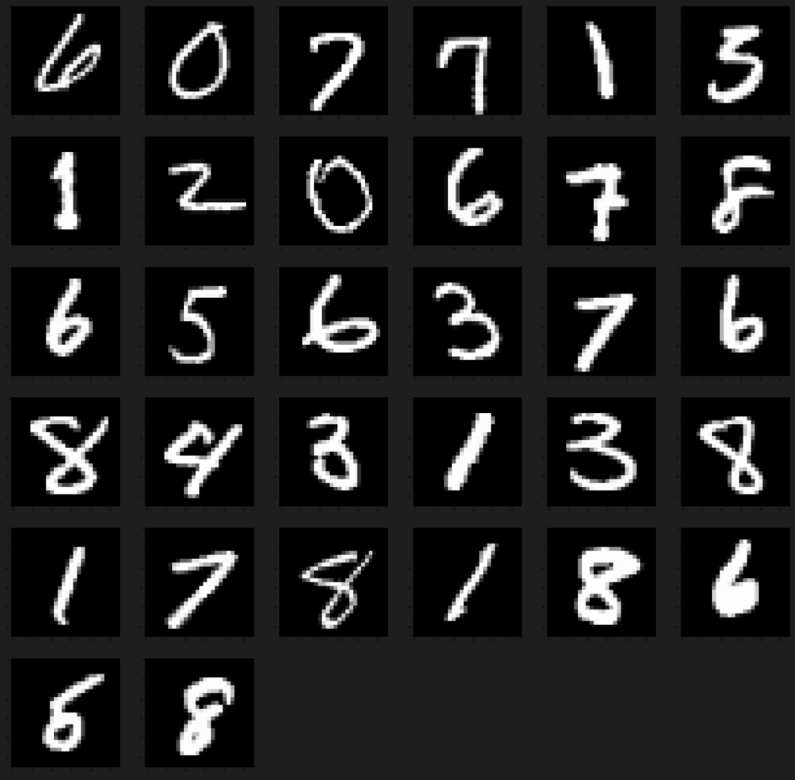
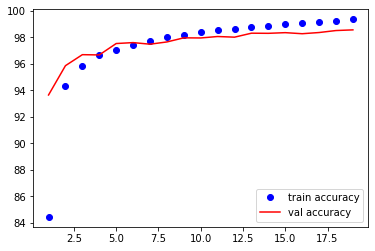

本章节主要通过深度学习“Hello World”之Mnist图像分类，学会深度学习的基本链路，快速搭建个人的Baseline模型，包括数据加载、数据可视化、模型构建、模型训练评估和模型结果指标的展示。

Mnist数据集是手写数字的MNIST数据库，包含60,000个用于训练的0~9的训练集和10,000个用于测试的测试集。这些数字已被大小归一化，并以固定尺寸的图像为中心。对于尝试学习深度学习技术的人来说，这是一个非常棒的数据集，同时花费最少时间来进行预处理和格式化。详细：[Mnist官网](http://yann.lecun.com/exdb/mnist/)

## 版本环境

版本环境主要包括：操作系统，显卡版本，深度学习Pytorch框架版本如下。

```python
系统：Windows 11
显卡：NVIDIA GeForce RTX 3060
python: 3.6.13
pytorch: 1.7.1
cudatoolkit: 11.0.221
torchvision: 0.8.2
```

### 导入包环境

本文使用的Python Package 主要有Pytorch的深度学习框架，torchvision用于加载Mnist数据集，matplotlib用于可视化展示数据集和展示训练结果等。

``` python
from torchvision import datasets, transforms
from torch.utils.data import DataLoader
import torch
import torch.optim as optim
import torch.nn as nn
import torch.nn.functional as F
import numpy as np
import random
import matplotlib.pyplot as plt
```

构建baseline模型核心是快速跑通完整链路，同时在Baseline的基础上迭代更新有合适的对比标准，方便验证算法模型的稳定性和正确性。为保证训练模型的可重复性，我们需要进行一些配置。全部配置主要分为三部分，具体如下：

* CUDNN配置，CUDNN中对卷积操作进行优化，牺牲精度来换取计算效率。
* Pytorch在运行中会有很多随机初始化操作，所以需要固定随机种子。
* Python & Numpy也需要固定对应的随机种子。
* 注意，如果Dataloader采用了多线程(num_workers > 1), 那么由于读取数据的顺序不同，最终运行结果也会有差异。也就是说，改变num_workers参数，也会对实验结果产生影响。

``` python
# 保证试验结果的稳定性
seed = 0
random.seed(seed)
np.random.seed(seed)
torch.manual_seed(seed)
torch.cuda.manual_seed_all(seed)
torch.backends.cudnn.benchmark = False
torch.backends.cudnn.deterministic = True

# 配置Cuda参数
is_cuda = False
if torch.cuda.is_available():
    is_cuda = True

# 模型参数
batch_size = 32
num_epochs = 2
```

## 模型数据

本章节就不详细讲解，大家可以查看前一章的讲解。More Info: [数据加载](https://yqstar.github.io/2022/05/05/Pytorch%E7%B3%BB%E5%88%97%E8%87%AA%E5%AD%A6%E6%95%99%E7%A8%8B-1-%E6%95%B0%E6%8D%AE%E5%8A%A0%E8%BD%BD%E4%B9%8BDataset%E5%92%8CDataLoader%E4%BD%BF%E7%94%A8/)

```python
# 构建Dataset
mnist_train_dataset = datasets.MNIST(root=r'./data',
                              transform=transforms.ToTensor(),
                              train=True,
                              download=True)

mnist_test_dataset = datasets.MNIST(root=r'./data',
                              transform=transforms.ToTensor(),
                              train=False,
                              download=True)

# 构建Dataloader
mnist_train_loader = DataLoader(mnist_train_dataset,batch_size=32,shuffle=True)

mnist_test_loader = DataLoader(mnist_test_dataset,batch_size=32,shuffle=True)
```

为更好地看到我们需要处理什么样的数据，我们可以用一些可视化的手段展示我们的数据。

``` python
# 图片查看
def plot_image(image,batch_size=32):
    x_batch,y_batch = image[0],image[1]
    f = plt.figure(figsize=(300,300))
    # mean = 0.1307
    # std = 0.3081
    # image = ((image * mean) + std)
    # plt.imshow(image, cmap='gray')
    for i in range(batch_size):
        image_tx = x_batch.numpy()[i]
        # image_ty = y_batch.numpy()[i]
        np.math.sqrt(32)
        # Debug, plot figure
        sub_size = int(np.math.sqrt(32))+1
        f.add_subplot(sub_size,sub_size, i + 1)
        plt.subplot_mosaic
        plt.imshow(image_tx[0], cmap='gray')
    plt.show()

sample_image_batch = next(iter(mnist_train_loader))
plot_image(sample_image_batch)

```

图片展示结果如下：



## 模型构建

```python
# 构建网络
class MnistNet(nn.Module):
    def __init__(self):
        super().__init__()
        self.conv1 = nn.Conv2d(in_channels=1,out_channels=32,kernel_size= 3)
        self.conv2 = nn.Conv2d(in_channels= 32,out_channels= 64,kernel_size= 3)
        self.dropout = nn.Dropout2d(0.25)
        self.fc1 = nn.Linear(9216, 128)
        self.fc2 = nn.Linear(128, 10)

    def forward(self, x):
        x = self.conv1(x)
        x = F.relu(x)
        x = self.conv2(x)
        x = F.relu(x)
        x = F.max_pool2d(x, 2)
        x = self.dropout(x)
        x = x.view(-1, 9216)
        x = self.fc1(x)
        x = F.relu(x)
        x = self.fc2(x)
        x = F.log_softmax(x, dim=1)
        return x
```

在进行模型训练过程中，我们可以使用以下代码，查看构建的模型特征

``` python

from torchinfo import summary
summary(model, input_size=(batch_size, 1, 28, 28),depth=4)

```


## 模型训练

### 模型训练函数

如果模型中有BN层(Batch Normalization）和Dropout，需要在训练时添加model.train()，在测试时添加model.eval()。其中model.train()是保证BN层用每一批数据的均值和方差，而model.eval()是保证BN用全部训练数据的均值和方差；而对于Dropout，model.train()是随机取一部分网络连接来训练更新参数，而model.eval()是利用到了所有网络连接。

``` python
# 模型训练函数
def fit_train(model,data_loader):
    model.train()
    running_loss = 0
    running_correct = 0
    for batch_idx, (data, target) in enumerate(data_loader):
        if is_cuda:
            data, target = data.cuda(), target.cuda()
        optimizer.zero_grad()
        output = model(data)
        loss = F.nll_loss(output, target)
        running_loss += F.nll_loss(output ,target ,reduction='sum').item()
        preds = output.data.max(1, keepdim=True)[1]
        running_correct += preds.eq(target.data.view_as(preds)).cpu().sum()
        loss.backward()
        optimizer.step()
    loss = running_loss/len(data_loader.dataset)
    accuracy = 100. * running_correct/len(data_loader.dataset)
    print(f"Train loss is {loss:{5}.{2}} and Train accuracy is {accuracy:{10}.{4}} %")
    return loss, accuracy

# 模型评估函数
def fit_eval(model,data_loader):
    model.eval()
    running_loss = 0
    running_correct = 0
    for batch_idx, (data, target) in enumerate(data_loader):
        if is_cuda:
            data, target = data.cuda(), target.cuda()
        output = model(data)
        loss = F.nll_loss(output, target)
        running_loss += F.nll_loss(output ,target ,reduction='sum').item()
        preds = output.data.max(1, keepdim=True)[1]
        running_correct += preds.eq(target.data.view_as(preds)).cpu().sum()
    loss = running_loss/len(data_loader.dataset)
    accuracy = 100. * running_correct/len(data_loader.dataset)
    print(f"Eval loss is {loss:{5}.{2}} and Eval accuracy is {accuracy:{10}.{4}} %")
    return loss, accuracy
```

初始化模型和配置优化函数。

```python
model = MnistNet()
if is_cuda:
    model.cuda()
optimizer = optim.SGD(model.parameters(),lr=0.01)

```

## 模型评估

``` python
train_losses, train_accuracy = [], []
val_losses, val_accuracy = [], []
for epoch in range(1, 20):
    epoch_loss, epoch_accuracy = fit_train(model, mnist_train_loader)
    val_epoch_loss, val_epoch_accuracy = fit_eval(model, mnist_test_loader)
    train_losses.append(epoch_loss)
    train_accuracy.append(epoch_accuracy)
    val_losses.append(val_epoch_loss)
    val_accuracy.append(val_epoch_accuracy)
```


```python
plt.plot(range(1,len(train_losses)+1),train_losses,'bo',label = 'training loss')
plt.plot(range(1,len(val_losses)+1),val_losses,'r',label = 'validation loss')
plt.legend()
plt.show()

```


```python
plt.plot(range(1,len(train_accuracy)+1),train_accuracy,'bo',label = 'train accuracy')
plt.plot(range(1,len(val_accuracy)+1),val_accuracy,'r',label = 'val accuracy')
plt.legend()
plt.show()

```



## 未来探索

写完了这一部分，我们基本上可以使用自己的数据，快乐地进行自己的炼丹之路了，但是道路阻且长,行则将至,但行好事莫问前程。总会有一些更好的解决方案。

* 模型结构还有哪些神奇的结构？包括Loss函数，优化函数，模型结构？
* 如何使用Tensorboard进行模型结构展示？
* 如何上线部署模型呢？如何实现从Mysql数据读取，到线上模型的完整的调用呢？
* 目前的模型仅仅是Demo模型，离生产上的使用还是有很大的距离？我们该不该记性完整链路的学习呢？
* 正如，人往往会对未知的事情产生恐惧，因为结局是未知的。所以当一切不再未知的时候，那么是不是就不会产生恐惧呢？
