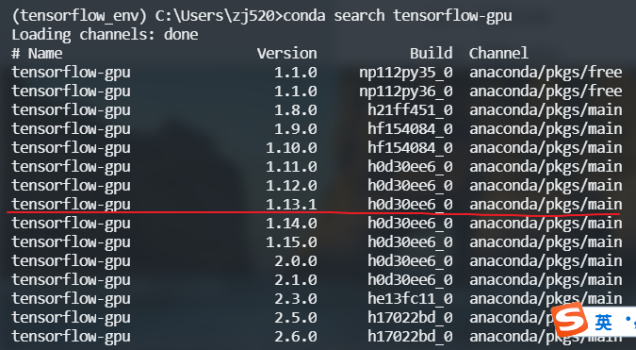
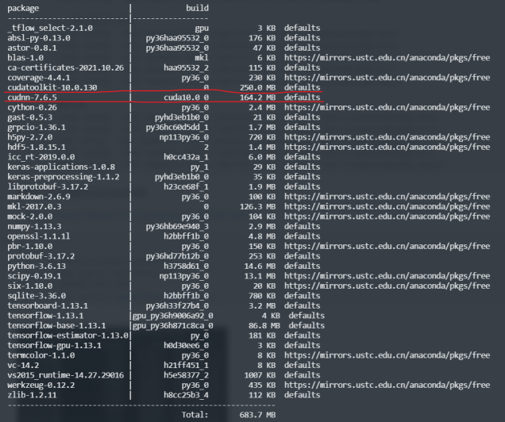
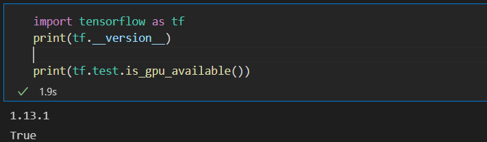
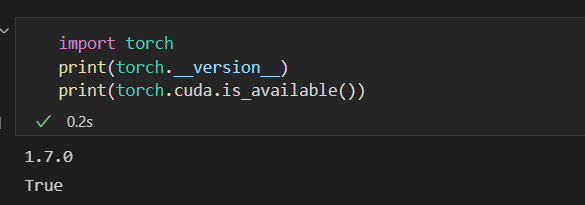

# Conda环境管理

Conda是一个开源的软件包管理系统和环境管理系统，可以管理不同的Python版本环境，不同的环境之间是互相隔离，互不影响的。

## 查看环境

``` 
# 查看当前环境
conda info --env
```

## 克隆环境
```
# 假设已有环境名为A，需要生成的环境名为B：
conda create -n B --clone A

# 如果特殊环境为Base，需要采用以下方式
conda update conda
conda create -n <my_env> --clone root
conda create -n torch_env --clone root
conda install pytorch=0.4.0 cuda90 -c pytorch

# 用于复制环境到新的机器
conda list --explicit > spec-file.txt
conda create --name <my_env> --file spec-file.txt
```

## 创建环境
```
 # 创建一个环境名为py34，指定Python版本是3.4 
 #（不用管是3.4.x，conda会为我们自动寻找3.4.x中的最新版本） 
 conda create --name py34 python=3.4 
 
 # 通过创建环境，我们可以使用不同版本的Python 
 conda create --name py27 python=2.7
```
 
## 激活环境
```
# 在windows环境下使用activate激活 
activate py34

# 在Linux & Mac中使用source activate激活 
source activate py34 
```

## 退出环境
```
# 在windows环境下使用
deactivate <my_env>

# 在Linux & Mac中使用
source deactivate <my_env>
```

## 删除环境
```
# 如果你不想要这个名为py34的环境，可以通过以下命令删除这个环境。 
conda remove -n py34 --all 

# 可以通过以下命令查看已有的环境列表，现在py34已经不在这个列表里。 
conda info -e
```

## 配置镜像
```
# 显示目前的channels 
conda config --show channels 
# 切换默认镜像源 
conda config --remove-key channels

# 删除指定channel 
conda config --remove channels_URL 

# Windows 用户无法直接创建名为 .condarc 的文件，使用以下命令 C:\Users\用户名\.condarc
conda config --set show_channel_urls yes

# 中科大镜像源 
conda config --add channels https://mirrors.ustc.edu.cn/anaconda/pkgs/main/ 
conda config --add channels https://mirrors.ustc.edu.cn/anaconda/pkgs/free/
conda config --add channels https://mirrors.ustc.edu.cn/anaconda/cloud/conda-forge/ 
conda config --add channels https://mirrors.ustc.edu.cn/anaconda/cloud/msys2/ 
conda config --add channels https://mirrors.ustc.edu.cn/anaconda/cloud/bioconda/ 
conda config --add channels https://mirrors.ustc.edu.cn/anaconda/cloud/menpo/ 
conda config --add channels https://mirrors.ustc.edu.cn/anaconda/cloud/ 
 
# 北京外国语大学源 
conda config --add channels https://mirrors.bfsu.edu.cn/anaconda/pkgs/main 
conda config --add channels https://mirrors.bfsu.edu.cn/anaconda/pkgs/free 
conda config --add channels https://mirrors.bfsu.edu.cn/anaconda/pkgs/r 
conda config --add channels https://mirrors.bfsu.edu.cn/anaconda/pkgs/pro 
conda config --add channels https://mirrors.bfsu.edu.cn/anaconda/pkgs/msys2

# 清华源 
conda config --add channels https://mirrors.tuna.tsinghua.edu.cn/anaconda/pkgs/main
conda config --add channels https://mirrors.tuna.tsinghua.edu.cn/anaconda/pkgs/free 
conda config --add channels https://mirrors.tuna.tsinghua.edu.cn/anaconda/pkgs/r 
conda config --add channels https://mirrors.tuna.tsinghua.edu.cn/anaconda/pkgs/pro 
conda config --add channels https://mirrors.tuna.tsinghua.edu.cn/anaconda/pkgs/msys2 

```

# Tensorflow环境安装

查看Tensorflow版本和安装指定版本。

```
# 查询tensorflow-gpu的版本
conda search tensorflow-gpu
# 指定版本进行安装
conda install tensorflow-gpu==1.13.1
```


安装过程中会安装cudatoolkit-10.0.130和cudnn-7.6.5。 



执行下述命令查看tf版本和GPU是否生效。

```
查看是否安装成功
import tensorflow as tf

# 打印Tensorflow版本
print(tf.__version__)

# 打印是否支持GPU
print(tf.test.is_gpu_available())
```

根据图片打印结果，成功安装tf 1.13.1 版本，同时GPU安装生效。




# Pytorch环境安装

执行下述命令安装Pytorch。

```
conda install pytorch==1.7.0 torchvision==0.8.0 torchaudio==0.7.0 cudatoolkit=10.1 -c pytorch
```
执行下述命令查看torch版本和GPU是否生效。

``` python
import torch

print(torch.__version__)

print(torch.cuda.is_available())

```

根据图片打印结果，成功安装Pytorch 1.7.0 版本，同时GPU安装生效。




# 参考

* More info: [阿尔发go：conda常用命令](https://blog.csdn.net/zhayushui/article/details/80433768?utm_medium=distribute.pc_relevant_t0.none-task-blog-BlogCommendFromMachineLearnPai2-1.nonecase&depth_1-utm_source=distribute.pc_relevant_t0.none-task-blog-BlogCommendFromMachineLearnPai2-1.nonecase)

* More info: [卖萌哥：conda的安装与使用](https://www.jianshu.com/p/edaa744ea47d)

* More info: [无聊就看书：Tensorflow-gpu1.13.1 和 Tensorflow-gpu2.0.0共存之安装教程](https://www.cnblogs.com/liuhuacai/p/11684666.html)