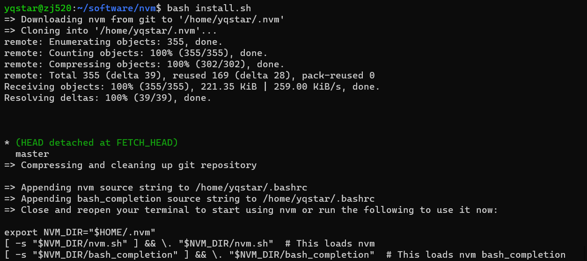
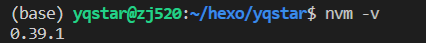
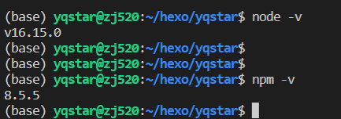
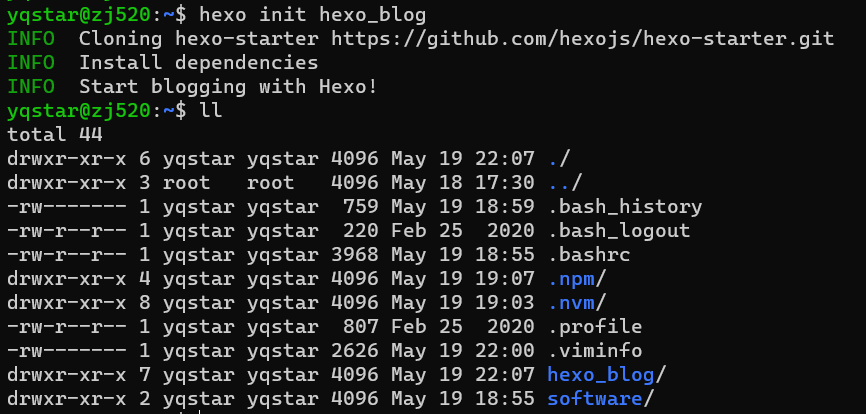
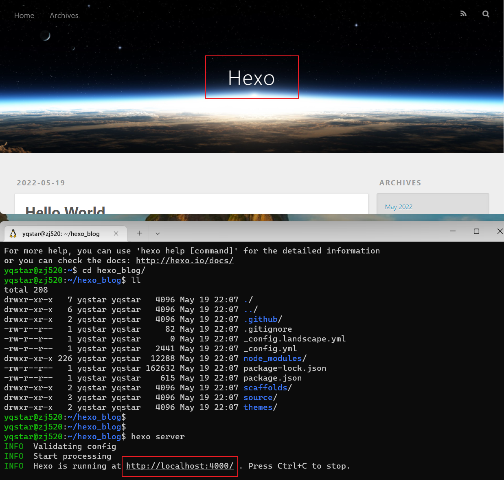
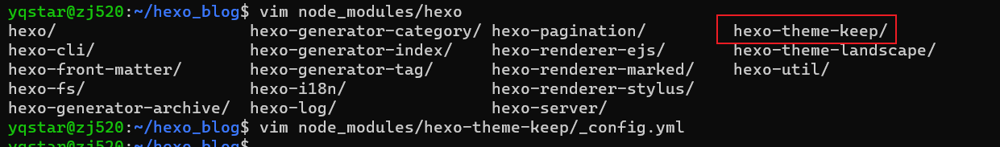
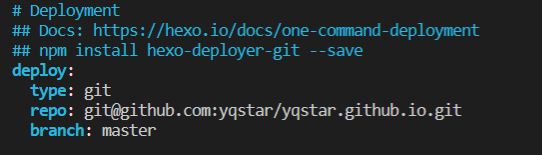
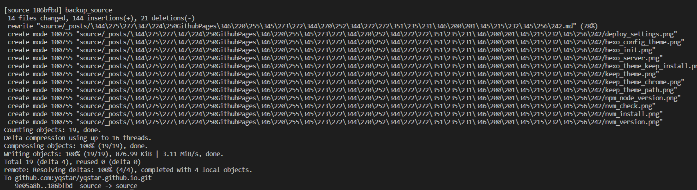
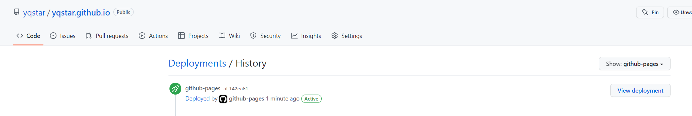

## 原理

**GitHub Pages** 是使用 GitHub 存储仓库托管静态网站，使用 YAML 和 Markdown 等标准技术，任何人都可以在几分钟内生成和维护网站，但它不仅仅是静态文件的集合。通过利用 Jekyll 和 Liquid 等网站生成技术，开发人员可定义完整静态网站的动态模板。每次将更改提交到与网站关联的源代码分支时，都会使用源代码分支的最新代码配置重新生成静态网页，Github 自动将其发布到目标 URL。欢迎关注：[我的博客](https://yqstar.github.io/)。

## 环境配置

``` bash
操作系统：Windows11 -> WSL2 -> Ubuntu 22.04 LTS
Node.js: v16.15.0
Npm: 8.5.5
```

## 操作部署

### 安装NVM

在安装nvm之前简单介绍下nvm，nodejs和npm之间的关系。

* nvm：*nodejs* 的版本管理工具。
* nodejs：项目开发所需要的代码库。
* npm：*nodejs* 包管理工具，*npm* 管理*nodejs*中的第三方插件。

参考 [NPM-GITHUB](https://github.com/nvm-sh/nvm)，使用以下命令安装nvm。

``` bash
wget -qO- https://raw.githubusercontent.com/nvm-sh/nvm/v0.39.1/install.sh | bash
```

安装过程Info截图如下：



判断nvm安装是否成功,可以使用以下命令查看nvm的版本信息。

``` bash
nvm -v
```



### 安装NODEJS

使用 *nvm install* 命令可以安装指定版本的NodeJs，本次安装v16版本，执行以下命令。

``` bash
nvm install 16
```

通过下述命令查看node和npm的版本。

``` bash
node -v
npm -v
```

可查看到Node和npm的版本。



## 安装Hexo和配置

### 安装Hexo命令行

Hexo是一个快速、简洁且高效的博客框架，官方提供一个命令行工具，用于快速创建项目、页面、编译、部署Hexo博客，安装命令行工具。

``` bash
npm install -g hexo-cli
```

### 初始化本地运行

接下来我们使用 Hexo 命令行创建一个项目，并将其在本地跑起来，整体跑通看看。

首先使用如下命令创建项目：**hexo init {blog_name}**，这里的 blog_name 就是博客名，我这里要创建 *hexo_blog* 的博客，我就把项目取名为 hexo_blog ，命令如下：hexo init hexo_blog。

``` bash
hexo init {blog_name}
cd {blog_name}
npm install
hexo server
```

hexo_blog 文件夹下就会出现 Hexo 的初始化文件，包括 themes、scaffolds、source 等文件夹。



接下来我们首先进入新生成的文件夹里面，然后调用 Hexo 的 generate 命令，将 Hexo 编译生成 HTML 代码，命令如下：hexo generate可以看到输出结果里面包含了 js、css、font 等内容，并发现他们都处在了项目根目录下的 public 文件夹下面了。

然后使用 Hexo 提供的 server 命令把博客在本地运行起来，命令如下：hexo server 运行之后命令行输出如下：

``` bash
INFO  Start processing
INFO  Hexois running at http://localhost:4000 . Press Ctrl+C to stop.
```

本地 4000 端口上就可以查看博客站点，如图所示：



### 主题配置

登录官网[Hexo官网](https://hexo.io/zh-cn/),然后点击主题页面[Theme主题](https://hexo.io/themes/)，选择一个喜欢主题，我这边选择的主题是
[keep主题](https://keep-docs.xpoet.cn/usage-tutorial/configuration-guide.html#base-info)。
执行安装命令，会将主题文件安装在node_modules文件夹中。

``` bash
npm install hexo-theme-keep --save
```



执行hexo server命令执行本地查看。

可以看出此时数据已经更新成keep主题。

## 部署到Github

执行部署到Github需要使用hexo-deployer-git插件

``` bash
npm install hexo-deployer-git --save
```

安装好hexo-deployer-git后可以进行文件的配置。
具体配置如下：



在这之前需要github配置相应的仓库，我配置的仓库名为：yqstar.github.io.





## 参考

MoreInfo:[hexo-asset-image插件](https://github.com/xcodebuild/hexo-asset-image)
MoreInfo:[如何使用本地插入图片](https://blog.csdn.net/fitnig/article/details/106522811)